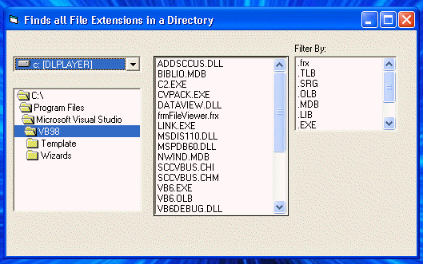

## Read All Extensions in A Directory

### Description

I wrote this for someone who needed to know how to read in all the file extensions in a directory and keep updating it when changing directories. It uses InStr to find the "." and then does a bubble sort (not efficient I know).
 
### More Info
 

             |
---                |---
**Submitted On**   |2002-03-24 20:45:12
**By**             |[Dave Lein](https://github.com/Planet-Source-Code/PSCIndex/blob/master/ByAuthor/dave-lein.md)
**Level**          |Beginner
**User Rating**    |5.0 (10 globes from 2 users)
**Compatibility**  |VB 6\.0
**Category**       |[Files/ File Controls/ Input/ Output](https://github.com/Planet-Source-Code/PSCIndex/blob/master/ByCategory/files-file-controls-input-output__1-3.md)
**World**          |[Visual Basic](https://github.com/Planet-Source-Code/PSCIndex/blob/master/ByWorld/visual-basic.md)
**Archive File**   |[Read\_All\_E651213242002\.zip](https://github.com/Planet-Source-Code/dave-lein-read-all-extensions-in-a-directory__1-33036/archive/master.zip)

